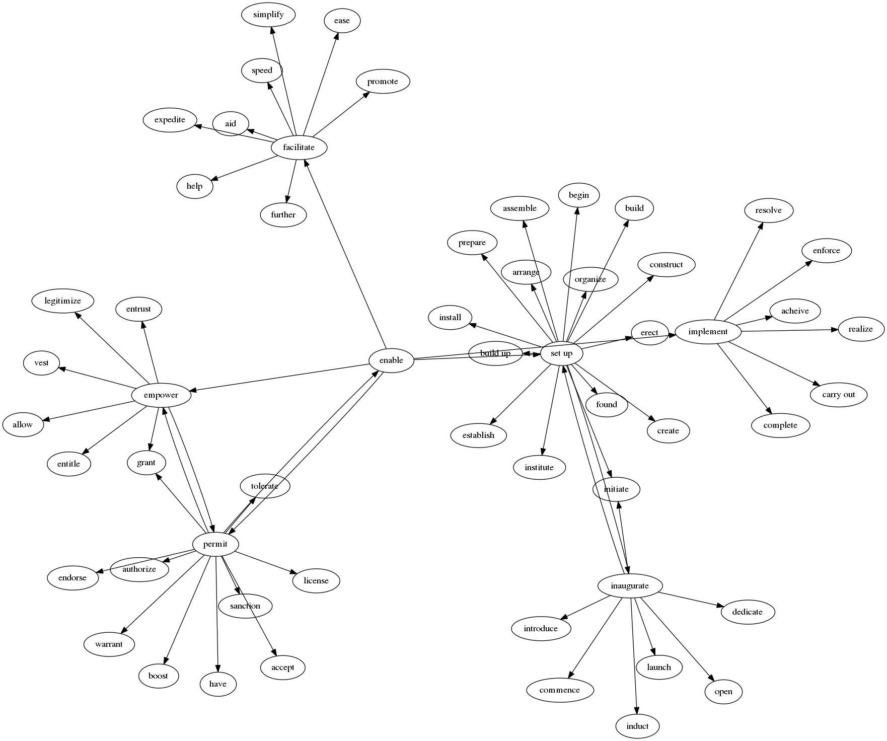

# thesaurus-graph
## find distant synonyms

This project aims to find relationships between words by representing a thesaurus as a graph. Vertices are words and edges are relationships between wrods, currently just synonyms. The program is a REPL that takes a word and a distance and returns a list of words as far as that distance. Think of it as a breadth first search with limited depth.

Here is a visualization of [small-thesaurus.csv](https://github.com/1ndy/thesaurus-graph/blob/master/small-thesaurus.csv).


`main.hs` and `main-reverse.hs` were PoC programs to let me experiemnt with these ideas but the graph library I was using lacked some functionality so I switched to NetworkX and python for the UI. More work needs to be done to improve its interface, and I need to play with larger graphs.

## usage
Two types of queries are supported by `main.py` right now. The first is a "distant synonym finder" that uses a limited breadth first search to find words.
```
query> enable 1
['enable', 'empower', 'facilitate', 'implement', 'set up', 'permit']
query> enable 2
['enable', 'empower', 'facilitate', 'implement', 'set up', 'permit', 'allow', 'legitimize', 'vest', 'entitle', 'grant', 'entrust', 'further', 'aid', 'help', 'promote', 'expedite', 'speed', 'ease', 'simplify', 'acheive', 'realize', 'carry out', 'complete', 'resolve', 'enforce', 'construct', 'initiate', 'assemble', 'build up', 'found', 'create', 'establish', 'inaugurate', 'erect', 'begin', 'build', 'prepare', 'organize', 'institute', 'install', 'arrange', 'boost', 'sanction', 'have', 'authorize', 'tolerate', 'warrant', 'license', 'accept', 'endorse']
```
The second kind of query finds paths between words if they exist
```
query> enable -> grant
['enable', 'empower', 'grant']
```
